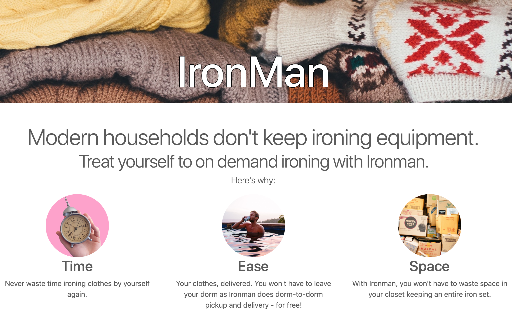

# Ironman
> www.theironmanapp.com

[]()
[![Build Status][travis-image]][travis-url]

A platform to allow people to ditch their ironing set and easily order their clothes ironed online.

## Technology stack

* Backend - PHP
* Frontend - HTML, CSS, Javascript
    * Frameworks used - Bootstrap, Feather
* Frontend Validation - Javascript
* Database Management System - MySQL
* Creation, reading, updating, and deletion of order and user records done through mysqli in PHP.



## Installation
Suggested: Use MAMP to locally host the webpage after cloning from GitHub.


## Usage
There are two levels of access - customer(simply creating orders) and presser(viewing and fulfilling orders)

* Customer
    * Create account
          Index -> Create Account
    * Log In
          Index -> Log In -> Sign In
    * Create Order
          Index -> Log In -> New Order
    * View Order
          Index -> Log In
    * Cancel  Order
          Index -> Log In -> Cancel Order
    * Log Out
          (any page) -> Log Out  
* Presser
  * Create account
        Index -> Create Presser Account
  * Log In
        Index -> Log In -> Presser Sign In -> Sign In
  * View Open Orders
        Index -> Log In
  * Pick Up An Order
        Presser Sign In -> Sign In ->  Pick Up


## Testing setup
Here are some testing credentials:
* Customer:
  email:
  password:

## To Be Implemented:

* 2.0
    * Stripe Payment System integration
* 2.1
    * Reward system for Pressers

## JavaScript
Javascript is used for interactivity in the Account Creation (createaccount.php) page:

```javascript
document.querySelector('form').onsubmit = function(){.......}
```      

## Database
Here is how the data is formatted:


## Contributing

1. Fork it (<https://github.com/yourname/yourproject/fork>)
2. Create your feature branch (`git checkout -b feature/fooBar`)
3. Commit your changes (`git commit -am 'Add some fooBar'`)
4. Push to the branch (`git push origin feature/fooBar`)
5. Create a new Pull Request

<!-- Markdown link & img dfn's -->
[npm-image]: https://img.shields.io/npm/v/datadog-metrics.svg?style=flat-square
[npm-url]: https://npmjs.org/package/datadog-metrics
[npm-downloads]: https://img.shields.io/npm/dm/datadog-metrics.svg?style=flat-square
[travis-image]: https://img.shields.io/travis/dbader/node-datadog-metrics/master.svg?style=flat-square
[travis-url]: https://travis-ci.org/dbader/node-datadog-metrics
[wiki]: https://github.com/yourname/yourproject/wiki
